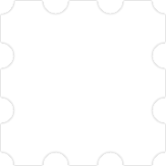

# 更好地使用 border-image

> CSS `border-image` 是一个用于创建自定义边框的属性，它允许你将图像应用到元素的边框上，以替代传统的纯色边框。在这篇文章中，我们将详细介绍如何使用 `border-image` 属性以及其各种选项。

> 本篇文章借助 CHatGPT 辅助编写

## 阅读本文您将收获
* `border-image` 基础语法
* `border-image` 属性说明
* `border-image` 注意事项
* `border-image` 完整示例

## 基本语法

* `border-image` 属性的基本语法如下：

```
border-image: source slice width outset repeat;
```

- `source`: 指定用于边框的图像源
- `slice`: 定义从图像中切割边框的方式
- `width`: 设置边框的宽度
- `outset`: 设置边框的外边距
- `repeat`: 控制边框图像的重复方式

## 属性说明

### 图像源 (`source`)

* `source` 参数可以是以下之一：
	* `none`：表示不使用图像，边框将遵循 border-style 的定义。
	* `url('@/assets/images/bgi.png')`  图像文件的 URL：。
    * `linear-gradient(to right, red, orange)`：表示使用线性渐变作为边框。
	* `current-color`：表示使用当前元素的文本颜色作为边框颜色。

```
<template>
	<div class="box">
        
 	</div>
</template>
<style scoped lang="scss">
.box {
  display: flex;
  justify-content: center;
  align-items: center;
  width: 100%;
  height: 100vh;
  text-align: center;
  background-color: #000;
  .img-box {
    width: 460px;
    object-fit: cover;
    border: 30px #000 solid; // 设置边框宽度和样式，不然border-image不起作用
    border-image-source: url('@/assets/images/bgi.png');
  }
}
</style>

```

> 此时img.box 的边框样式如下：



### 切割方式 (`slice`)

* `slice` 参数定义如何切割图像以适应边框。它有四个值，分别表示上、右、下、左的切割宽度。

```
border-image: url(border.png) 30 30 30 30 round;
```

### 边框宽度 (`width`)

* `width` 参数设置边框的宽度。可以是一个单一值，也可以是四个值，分别表示上、右、下、左的宽度。

```
border-image: url(border.png) 30 30 30 30 round;
```

### 外边距 (`outset`)

* `outset` 参数定义了边框图像的外边距，即边框图像与元素内容的距离。

```
border-image: url(border.png) 30 30 30 30 outset;
```

### 重复方式 (`repeat`)

* `repeat` 参数控制边框图像的重复方式。它有以下几个选项：

	* `stretch`: 默认值，拉伸图像以填充边框。
	* `repeat`: 重复图像以填充边框。
	* `round`: 拉伸或缩小图像以填充边框。
	* `space`: 在图像之间添加间隙以填充边框。

```css
border-image: url(border.png) 30 30 30 30 round;
```

## 完整示例

* 以下是一个完整的示例，演示如何使用 `border-image` 创建自定义边框：

```css
.custom-border {
  border-image: url(border.png) 30 30 30 30 round;
  border-width: 30px;
  border-image-outset: 10px;
  border-image-repeat: round;
}
```

以上代码将为类名为 `.custom-border` 的元素创建一个自定义边框。