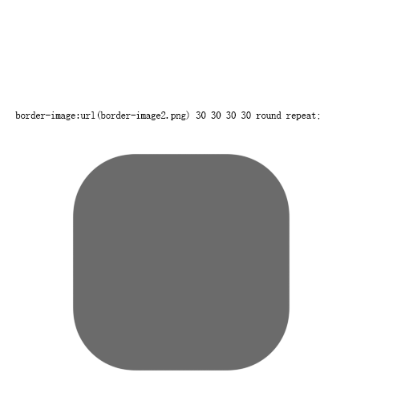

# 更好地使用 border-image

> CSS `border-image` 是一个用于创建自定义边框的属性，它允许你将图像应用到元素的边框上，以替代传统的纯色边框。在这篇文章中，我们将详细介绍如何使用 `border-image` 属性以及其各种选项。

> 本篇文章借助 CHatGPT 辅助编写

## 阅读本文您将收获
* `border-image` 基础语法
* `border-image` 属性说明
* `border-image` 注意事项
* `border-image` 完整示例

## 基本语法

* `border-image` 属性的基本语法如下：

```
border-image: source slice width outset repeat;
```

- `source`: 指定用于边框的图像源
- `slice`: 定义从图像中切割边框的方式
- `width`: 设置边框的宽度
- `outset`: 设置边框的外边距
- `repeat`: 控制边框图像的重复方式

## 属性说明

### 图像源 (`source`)

* `source` 参数可以是以下之一：
	* `none`：表示不使用图像，边框将遵循 border-style 的定义。
	* `url('@/assets/images/bgi.png')`  图像文件的 URL：。
    * `linear-gradient(to right, red, orange)`：表示使用线性渐变色作为边框。
	* `repeating-linear-gradient(45deg, transparent, #4d9f0c 20px)`：表示创建重复的线性渐变背景的函数作为边框颜色。

### 切割方式 (`slice`)

* `slice` 参数定义如何切割图像以适应边框。它有四个值，分别表示上、右、下、左的切割宽度。
    * `number `: 表示切割的宽度为指定数量的像素。**千万不要给数值带单位哦。**
    * `percentage`: 表示切割的宽度为指定百分比的宽度。
    * 值（数值、百分比）可以写 1-4 个，理解方式参考 padding 和 margin 的值。 
    * `fill` “填充”: 源图片 9 宫格的中心块将作为该元素的背景。



### 边框宽度 (`width`)

* `border-image-width` 参数的四种类型:
  * `length`: 带 px, em, in … 单位的尺寸值。
  * `percentage`: 百分比。
  * `number`: 不带单位的数字；它表示 border-width 的倍数。
  * `auto`: 使用 auto， border-image-width 将会使用 border-image-slice 的值
	
border-image-width的缺省值是 number 类型：1，即边框图片的宽度跟边框的宽度一致。

```
border-image-width: [ <length> | <percentage> | <number> | auto ]{1,4}
```

### 外边距 (`outset`)

* `outset` 定义边框图像可超出边框的大小。

```
border-image-outset:[ <length> | <number> ]{1,4};
```

### 重复方式 (`repeat`)

* `repeat` 参数控制边框图像的重复方式。它有以下几个选项：

	* `stretch`: 默认值，拉伸图像以填充边框。
	* `repeat`: 重复图像以填充边框,可能出现图片不完整情况。
	* `round`: 平铺图像，当不能整数次平铺时，根据情况放大或缩小图像。
	* `space`: 平铺图像 。当不能整数次平铺时，会用空白间隙填充在图像周围（不会放大或缩小图像）。

```
border-image-repeat:[ stretch | repeat | round | space ]{1,2} ;
```

## 完整示例

[点击查看完成实例](https://github.com/wshsh1996/vue-pc-project/blob/main/src/views/border-image/index.vue)

